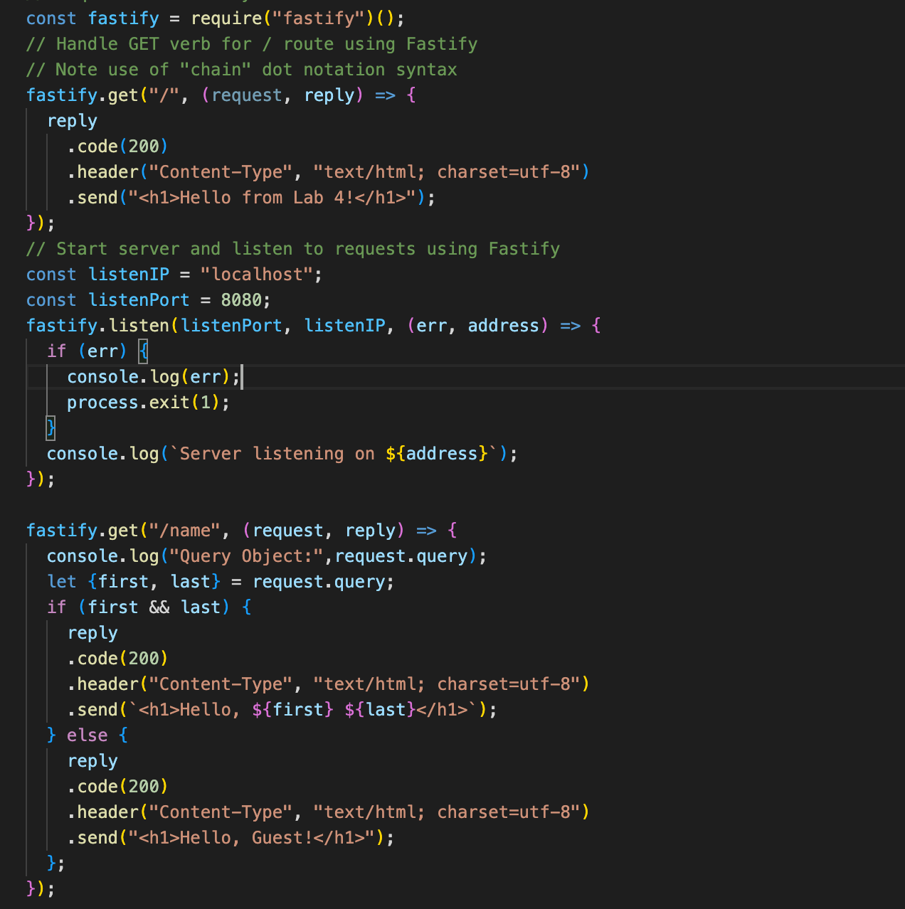

# cit281-lab-4
[cit281 lab-4](https://github.com/UO-CIT-qiqima/cit281-lab-4)

Lab 4:
1. Practice install Fastify Node.js.
2. Practice use Node Package Manager (npm) to install packages.
3. Add git repo and put node_modules folder into .gitignore because node_modules is so large.
4. Practice use commit
5. Learn some MIME error.
6. Learn to add a second route with query parameters.

